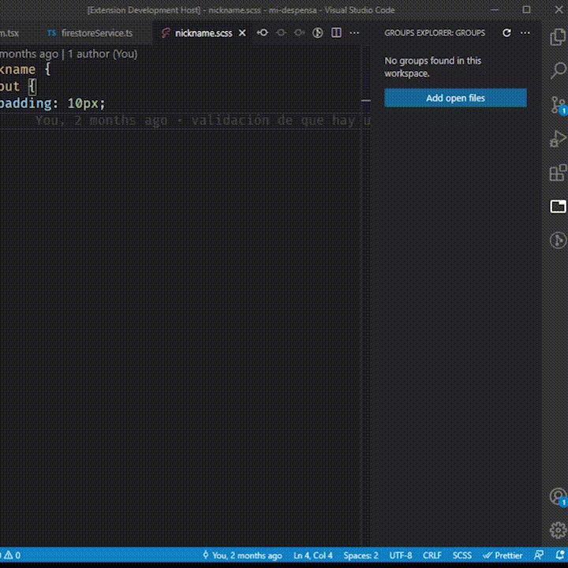
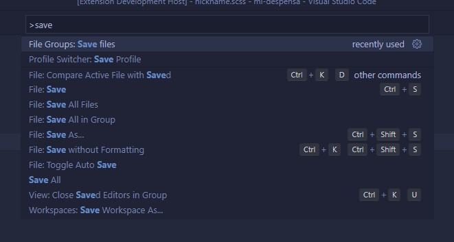
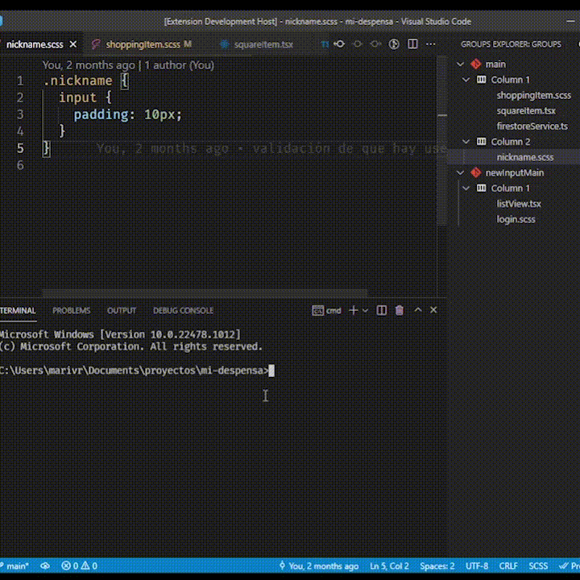
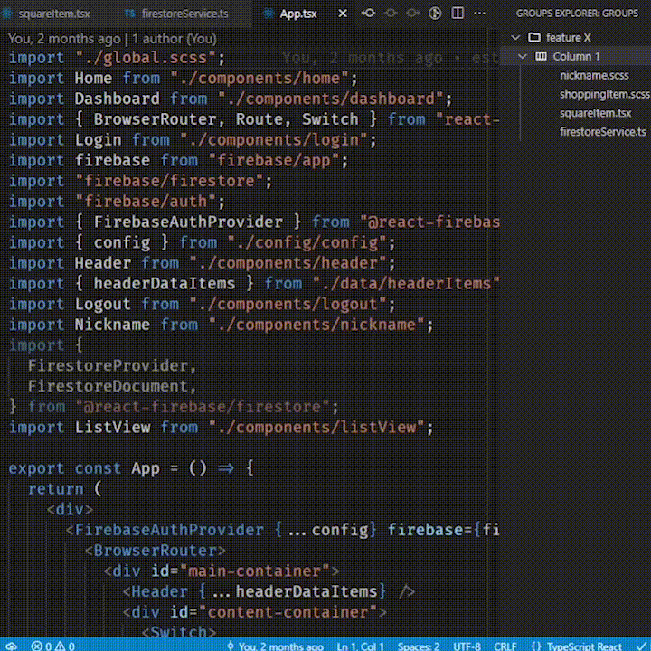

# File Groups

File Groups is an extension for Visual Studio Code that allows to create groups of files and sync them with Git branches in a workspace. This is useful if you work on different features across your project and you want to keep track of the files related to each feature, bug, etc.

## Features

You can save the current open files in your workspace into a new group by opening the groups section in the side bar.

If you have a group created you can click the three dots or in the command bar write `add files`

If you are using Git you can confirm to sync your group with your current branch, so if you change branches it will automatically load the group associated.

Finally, you can add a file to a group with the contextual menu and select the group from the list.

Describe specific features of your extension including screenshots of your extension in action. Image paths are relative to this README file.

For example if there is an image subfolder under your extension project workspace:

## Requirements

You don't need any requirements for this extension. Just open a new folder and start creating your groups of files. Sync with Git is an optional feature available in case your project is using it, otherwise you can always choose not to link your groups.

## Extension Settings

This extension contributes the following settings:

- `myExtension.enable`: enable/disable this extension
- `myExtension.thing`: set to `blah` to do something

## Known Issues

- The extension doesn't support untiled or removed files. If you open a group and you have one of these files they will be removed completely from your workspace, so please make sure you don't open a group if you haven't save your work previously.
- Sometimes the files don't open in the corresponding column

## Release Notes

### 1.0.0

Initial release of the extension with the basic functionality
